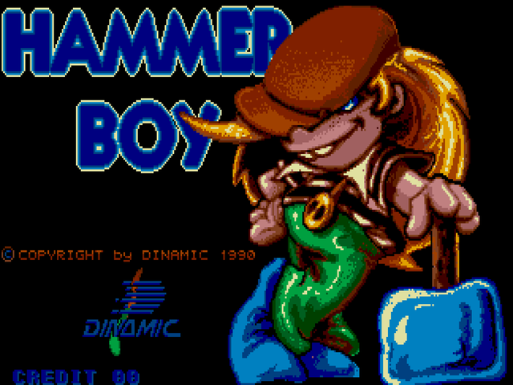
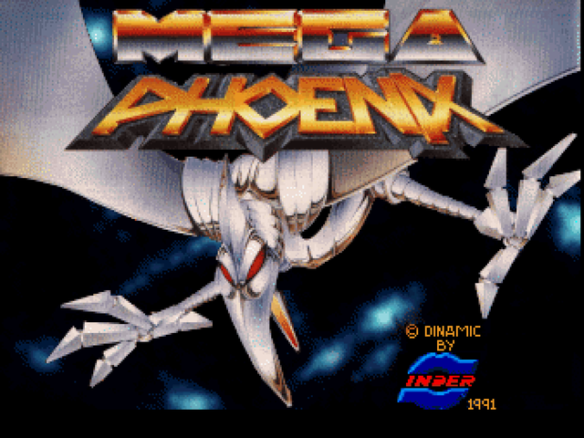
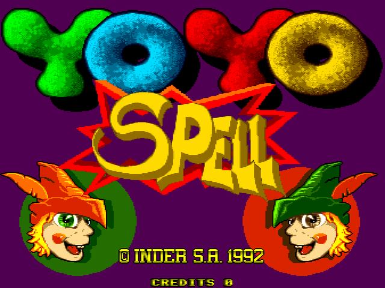

# inder-dinamic-fpga

Inder & Dinamic arcade cores for **MiSTer**. · Cores arcade de **Inder & Dinamic** para **MiSTer**.

<!-- MOSAICO:AUTO -->

## Horizontal

<table>
<tr>
<td align="center" width="33%"><a href="DETAILS.md#games"></a><br><b>Hammer Boy</b> · 1990</td>
<td align="center" width="33%"><a href="DETAILS.md#games"></a><br><b>Mega Phoenix</b> · 1991</td>
<td align="center" width="33%"><a href="DETAILS.md#games"></a><br><b>YoYo Spell (prototype)</b> · 1992</td>
</tr>
</table>

<!-- /MOSAICO:AUTO -->

<!-- INSTALAR:AUTO -->

## How to install the Inder & Dinamic cores on your MiSTer FPGA

Two options:

1. **Download and copy them yourself.** Copy the contents of [`_Arcade/`](_Arcade/) to the `_Arcade/` folder of your MiSTer SD card
   (the `.rbf` goes to `_Arcade/cores/`). One `.rbf` runs all three games; each `.mra` selects one.
2. **Let the MiSTer Downloader do it.** Add the [jlrh-misterfpga-db](https://github.com/jlrh/jlrh-misterfpga-db)
   database to `downloader.ini` (root of the SD card) and run `Scripts → update`. It installs these cores **and the
   rest of jlrh's arcade cores** (Konami, Gaelco, Seibu, Cidelsa…), and keeps them all up to date.

```ini
[jlrh/jlrh-misterfpga-db]
db_url = https://raw.githubusercontent.com/jlrh/jlrh-misterfpga-db/db/db.json.zip
```

**ROMs are not included.** Bring your own MAME romsets (merged, MAME 0.288) into `games/mame/`. The exact set each core
expects is in [`ROMS.md`](https://github.com/jlrh/jlrh-misterfpga-db/blob/main/ROMS.md).

**More:** hardware, status, controls and credits of each core in [`DETAILS.md`](DETAILS.md). Screenshots taken from MAME.

Built on the GPLv3 **JTFRAME** framework. Independent project — **not** an official jotego core. License: GPLv3
([`LICENSE`](LICENSE)).

## Cómo instalar los cores de Inder & Dinamic en tu MiSTer FPGA

Dos opciones:

1. **Descargarlos y copiarlos tú.** Copia el contenido de [`_Arcade/`](_Arcade/) a la carpeta `_Arcade/` de la SD de tu MiSTer
   (el `.rbf` va a `_Arcade/cores/`). Un solo `.rbf` mueve los tres juegos; cada `.mra` elige uno.
2. **Que lo haga el MiSTer Downloader.** Añade la base de datos
   [jlrh-misterfpga-db](https://github.com/jlrh/jlrh-misterfpga-db) a `downloader.ini` (en la raíz de la SD) y ejecuta
   `Scripts → update`. Instala estos cores **y el resto de cores arcade de jlrh** (Konami, Gaelco, Seibu, Cidelsa…), y los
   mantiene todos al día.

```ini
[jlrh/jlrh-misterfpga-db]
db_url = https://raw.githubusercontent.com/jlrh/jlrh-misterfpga-db/db/db.json.zip
```

**Las ROMs no se incluyen.** Pon tus propios romsets de MAME (merged, MAME 0.288) en `games/mame/`. El set exacto que
espera cada core está en [`ROMS.md`](https://github.com/jlrh/jlrh-misterfpga-db/blob/main/ROMS.md).

**Más:** hardware, estado, controles y créditos de cada core, en [`DETAILS.md`](DETAILS.md). Capturas tomadas de MAME.

Hechos sobre el framework **JTFRAME** (GPLv3). Proyecto independiente — **no** es un core oficial de jotego. Licencia:
GPLv3 ([`LICENSE`](LICENSE)).

<!-- /INSTALAR:AUTO -->
